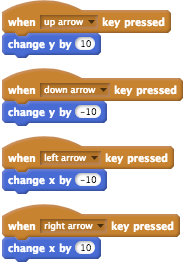

# Coding Concepts Activity Solutions

## Sequencing

### Exercise 1

The cat will pause twice (as there is 2 wait blocks) and it will move 80 steps in total (this is 10 + 20 + 40 + 10 from the move blocks).

### Exercise 2

The Cat will appear to not move at all. 
This is for two reasons. 
Firstly, we would have to include wait blocks to see the Cat moving around the canvas.
As there is no wait blocks, the Cat runs through all of the move blocks in one movement.
Secondly, if you add up all of the steps (100, -100, 200 and -200) you get 0.
When the Cat moves 0 steps, it doesn't move at all.

### Exercise 3

Yes, the student has explained the code correctly.

## Repetition

### Exercise 1

As the *repeat* block will repeat 4 times, the snare drum noise will play 4 times.

### Exercise 2

The student is incorrect for two reasons:

1.	The Cat will move to the left (move -10 means move 10 steps to the left)
2.	The Cat will move 10 times in total, not 5

The Cat will actually move towards the left 10 times.

### Exercise 3

The Cat will move to the right 6 times in total. 
The outer loop repeats 2 times.
The inner loop repeats 3 times.

## Variables

### Exercise 1

The variables will be *a*, *b*, *c*, *x* and *y*

- *a* will be a *Number* value: *5*
- *b* will be a *Number* value: *10*
- *c* will be a *Number* value: *15*
- *x* will be a *String* value: *Hello World!*
- *y* will be a *Boolean* value: *false*

### Exercise 2

The value of *times* will be 3.
The value of *times* will change like this:

1. the value of *times* will start at 0
2. the value of *times* will change by positive 2, so it would now be *2*
3. the value of *times* will change by negative 1, so it would now be *1*
4. the value of *times* will change by postive 4, so it would now be *5*
5. the value of *times* will change by negative 2, so it would now be *3*

The drum noise will play 3 times, as the times variable is used in the repeat block.

### Exercise 3

The 1 in the *change times space bar pressed* block should be a -1, instead of 1.
With a -1 in the *change times space bar pressed* block, the *change times space bar pressed* variable will decrease by 1 everytime you press the space bar.

### Exercise 4

As the number in the *change guest number by* block is 2, every second guest in the guest list will be skipped.
If we change the 2 in the *change guest number by* block to 1, every guest in the guest list will receive an email.

## User Input

### Exercise 1

The Cat will say: *Hello John*.
The *join* block joins the two bits of text together into one *String* value.

### Exercise 2

To get the program to work as the student expects they should reverse the order of the blocks. 
The *ask and wait* block is before the *say* block but these should be the other way around.

### Exercise 3

The student has confused the *x* and *y* axes and so all of the *change x* and *change y* blocks need to be swapped around.

The correct blocks are shown in the below image:

## Branching

### Exercise 1

The message: *Access Denied!* will appear for 2 seconds. 
This is because the answer will be *12345*, which does not equal *1234* and consequently the instructions contained in the else block will be followed. 
If the user had answered with: *1234*, then the message: *Access to Secret Documents: Granted* would have appeared.

### Exercise 2

- If the age of the player is 10, the *You're the right age to play this game!* message will appear.
- If the age of the player is 4, the *You're too young play this game!* message will appear.
- If the age of the player is 96, the *You're too old to play this game!* message will appear.

To have the message: *Let's start the game!* appear only when the player is the right age, the last say block will have to be placed after the say block that is third from the top, inside the second else block.

### Exercise 3

**Before the repeat until:**

- The *number* variable's value is set to 1

**The first repeat until:**

- The *repeat until* block action is followed for the first time
- The Cat will say: *Good work Sophie*, as *Sophie* is the first name in the *student names* list
- The *number* variable's value is increased by 1 to *2*

**The second repeat until:**

- The condition in the *repeat until* block is not true (the *number* variable's value is not greater than 3)
- So, the actions in the *repeat until* block are followed again
- The Cat will say: *Good work Tim*, as *Tim* is the second name in the *student names* list
- The *number* variable's value is increased by 2 to *3*

**The third repeat until:**

- The condition in the *repeat until* block is not true (the *number* variable's value is not greater than 3)
- So, the actions in the *repeat until* block are followed again
- The Cat will say: *Good work Mary*, as *Mary* is the third name in the *student names* list
- The *number* variable's value is increased by 3 to *4*

**The program ends:**

- The condition in the *repeat until* block is true now - the *number* variable's value is 4 and consequently it is greater than 3
- So, the actions inside the *repeat until* block are not followed again
- The Cat will say: *Program finished!* and the program will end

